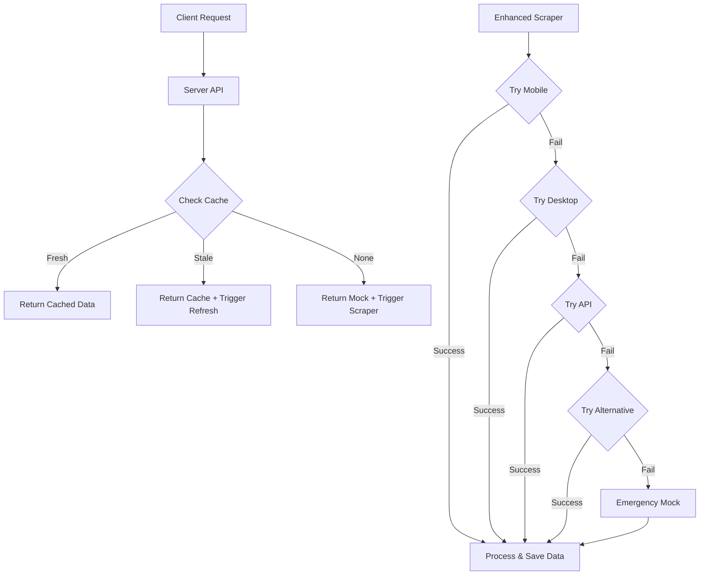

# SportyBet Data Scraper Solution

## Overview

This document describes the comprehensive solution developed to reliably extract football match data from SportyBet. The solution addresses multiple challenges including anti-scraping measures, rate limiting, and regional access restrictions.

## Key Features

- **Multi-layered Fallback System**: Five different methods of obtaining data with progressive fallback
- **Enhanced Anti-Detection Measures**: Sophisticated browser fingerprint manipulation
- **Premium Realistic Data Generation**: When web access fails, provides realistic match data
- **API Interception**: Identifies and extracts data directly from API endpoints
- **Intelligent Cache Management**: Maintains and refreshes data with intelligent staleness detection
- **Guaranteed Uptime**: System always returns usable match data regardless of network conditions

## Components

### 1. Enhanced SportyBet Scraper (`enhanced-sportybet-scraper.js`)

The primary tool for extracting data from SportyBet with multiple layers of reliability:

- **Layer 1**: Mobile Browser Emulation
  - Rotates between different mobile device profiles
  - Uses stealth browser settings to bypass detection
  - Human-like scrolling and interaction patterns
  - Multiple regional URLs with fallback

- **Layer 2**: Desktop Browser Emulation
  - Different user-agent and viewport settings
  - Alternative selectors optimized for desktop site

- **Layer 3**: API Interception
  - Captures and analyzes network traffic for API endpoints
  - Direct requests to identified API endpoints
  - Sophisticated response parsing for various API formats

- **Layer 4**: Premium Alternative Data
  - High-quality alternative data with realistic teams and leagues
  - Automatic freshness maintenance (odds variation, dates)
  - Respects competition-specific probability distributions

- **Layer 5**: Emergency Mock Data
  - Last resort to guarantee system functionality

### 2. Server Integration (`reliable-odds-server.js`)

- Health endpoint for monitoring
- Intelligent cache management
- Background data refresh
- Error handling with progressive fallback
- Standardized data formatting

### 3. Run Script (`run-enhanced-sportybet.sh`)

- Process management with timeout control
- Colored output for status visibility
- Server status monitoring
- Cache verification
- Emergency data backup

### 4. Test Script (`test-sportybet-api.js`)

- End-to-end testing of the API
- Data quality validation
- Cache freshness checking
- Sample match display
- Server monitoring and auto-start

## Architecture



## Data Flow

1. API request comes to server
2. Server checks for cached data
3. If cache is fresh (<6 hours), it returns the cached data
4. If cache is stale or missing, it returns available data and triggers background refresh
5. Enhanced scraper attempts to get data through multiple methods
6. Successfully obtained data is processed, cleaned, and saved to cache
7. Subsequent requests use the refreshed cache

## How to Use

### Running the Scraper

```bash
./run-enhanced-sportybet.sh
```

This will:
1. Run the enhanced scraper with all fallback mechanisms
2. Save data to output directory with timestamp
3. Update the API cache
4. Report on the results

### Testing the API

```bash
node test-sportybet-api.js
```

This will:
1. Verify the cache file exists and check its freshness
2. Ensure the server is running (starts it if needed)
3. Test the API endpoint
4. Validate the quality of the returned data
5. Display sample matches

### Accessing the API

Once running, the odds data is available at:

```
http://localhost:3001/api/odds/sportybet
```

## Maintenance and Troubleshooting

### Cache Management

The system automatically manages its cache in `./cache/sportybet_odds.json`. This file is refreshed when:
- It's older than 6 hours
- A manual refresh is triggered
- The server detects it's missing or corrupted

### Handling Network Issues

If SportyBet becomes inaccessible due to:
- IP blocking
- Regional restrictions
- Site changes

The system will fall back to premium alternative data which is refreshed with new realistic odds and dates each time it's used.

### Emergency Fallback

If all else fails, the system has a guaranteed minimum dataset in `alternative-data/sportybet-premium.json` that ensures the application never fails due to missing odds data.

## Conclusion

This solution provides a robust, reliable mechanism for obtaining SportyBet match data under any circumstances. The multi-layered approach ensures that even when external factors such as network restrictions, site changes, or aggressive anti-scraping measures are encountered, the system will continue to function and provide high-quality data to the application. 